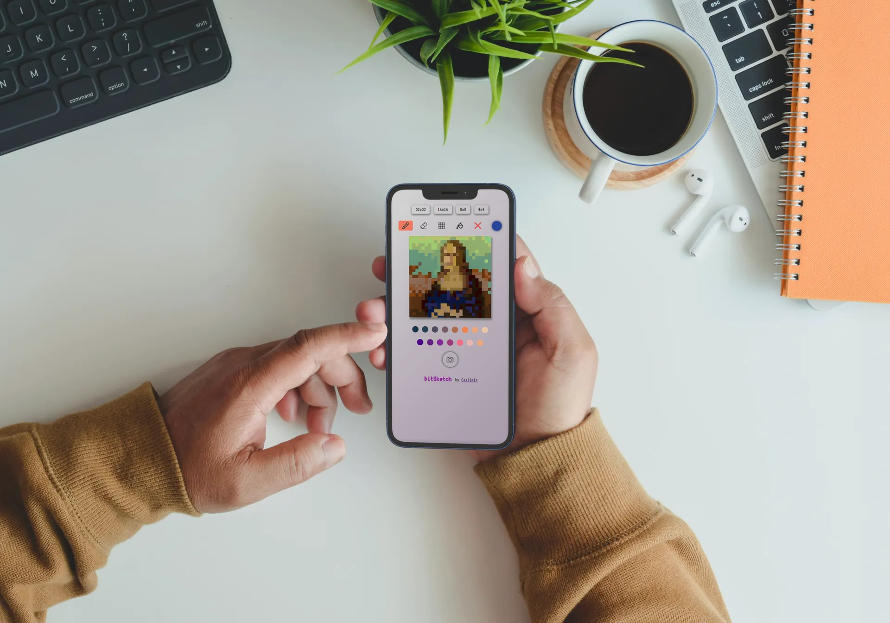
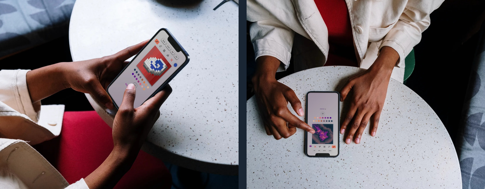

# bitSketch
#### An open source project: a retro style drawing app, to improve the little artist inside us!

### Description
Let’s talk about something fun and awkward, something that allow us to improve the artist inside all of us: drawing abstract pixel-art!
I appreciate abstract art, apparent meaningless patterns able to transmit different emotions based on different states of mind. BitSketch helps to make precisely this form of art, with a digital retro touch!
Let's create your next profile image, just as I did...

### Background
Who never had an 'Etch a sketch' as a child? Drawing our houses and magnificent dwarf trees? I often enjoyed drawing planets and spaceships... This project was born in order to bring that artistic child that still lives inside of us to the surface.

My goal was to write the app entirely in javascript, without any framework. That part is done. Nevertheless, I decided the project is not complete yet. I am actually working on it daily adding code and functionalities.

### Additional Resources/Info
I want to implement:

- ✔️ A mirror functionality that clone an half part of the container, and render the same in the second half
- ✔️ a pick color tool
- ✔️ a better, and more customable, grid system
- ✔️ a registration form with a personal profile with the saved personal sketches, on mutiple devices
- ✔️ a monthly challenge that highlights top ten artists
and much more!

 
